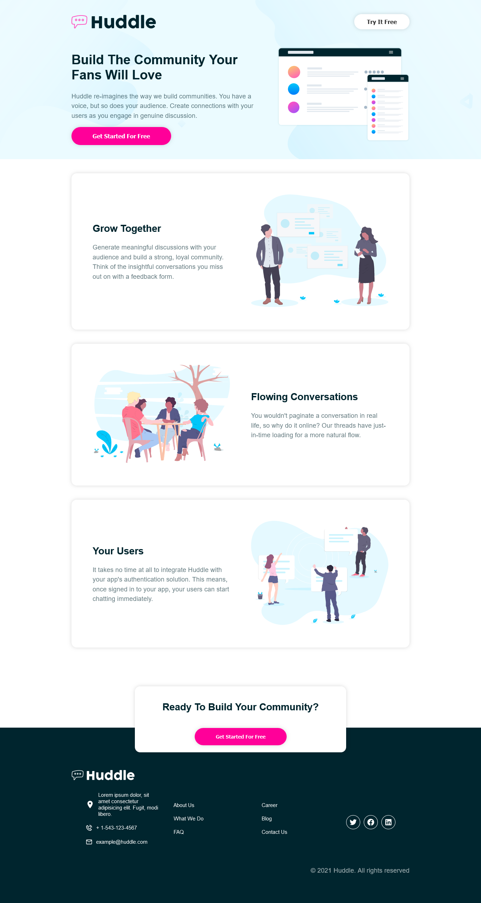
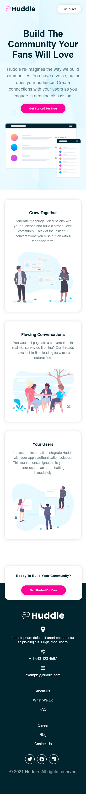

# Frontend Mentor - Huddle landing page with alternating feature blocks solution

This is a solution to the [Huddle landing page with alternating feature blocks challenge on Frontend Mentor](https://www.frontendmentor.io/challenges/huddle-landing-page-with-alternating-feature-blocks-5ca5f5981e82137ec91a5100). Frontend Mentor challenges help you improve your coding skills by building realistic projects. 

## Table of contents

- [Frontend Mentor - Huddle landing page with alternating feature blocks solution](#frontend-mentor---huddle-landing-page-with-alternating-feature-blocks-solution)
  - [Table of contents](#table-of-contents)
  - [Overview](#overview)
    - [The challenge](#the-challenge)
    - [Screenshot](#screenshot)
      - [Desktop version](#desktop-version)
      - [Desktop version](#desktop-version-1)
    - [Links](#links)
  - [My process](#my-process)
    - [Built with](#built-with)
    - [What I learned](#what-i-learned)
  - [Author](#author)
## Overview

### The challenge

Users should be able to:

- View the optimal layout for the site depending on their device's screen size
- See hover states for all interactive elements on the page

### Screenshot

#### Desktop version  
 


#### Desktop version  



### Links

- Solution URL: [Add solution URL here](https://your-solution-url.com)
- Live Site URL: [Add live site URL here](https://your-live-site-url.com)

## My process

### Built with

- Semantic HTML5 markup
- CSS custom properties
- Flexbox
- [TypeScript](https://www.typescriptlang.org/) - JS superset
- [React](https://reactjs.org/) - JS library
- [Styled Components](https://styled-components.com/) - For styles and components
- [React Icons](https://react-icons.github.io/react-icons/) - For icons
- [Vite](https://https://vitejs.dev/) - Next Generation Frontend Tooling


### What I learned

I learned how to use styled components, applying theme to the page and how to use react icons. I also learned how to use the flexbox to make the page responsive.


```tsx
const  App:React.FC = () =>{


  return (
    <ThemeProvider theme={theme}>

    <>
    <GlobalStyles />
    <Header />
    <Container>
      {contents.map((content: Content, index) => {
        return <Card key={index} content={content} />
      }
      )}
    </Container>
     <CommunityContainer>
        <h2>Ready To Build Your Community?</h2>
        <CommunityButton color='#fff' bg='#ff0099'>Get Started For Free</CommunityButton>
     </CommunityContainer>
     <Footer />
    </>
    </ThemeProvider> 
  )
}

export default App
```
```css
const GlobalStyles = createGlobalStyle`
     /* Import Poppins + Open Sans fonts */
    @import url('https://fonts.googleapis.com/css2?family=Open+Sans:wght@300;400;600;700&family=Poppins:wght@300;400;600;700&display=swap');
  

    *{
        box-sizing: border-box;
    }

    body{
        background: ${({theme}) => theme.colors.body};
        color: hsl(192, 100%, 9%);
        font-family: 'Open Sans', sans-serif;
        font-size: 1.15em;
        margin: 0;
    }

    p{
        opacity: 0.6;
        line-height: 1.5;
        font-weight: 500;
    }

    img{
        max-width: 100%;
    }


`

export default GlobalStyles;
```
```ts
 interface Content {
    id: number;
    title: string;
    body: string;
    image: string;
}

export const Card:React.FC<{content: Content}> = ({content: {id, title, body, image}}) => {
  return (
    <StyledCard layout={`${id % 2 === 0 && 'row-reverse'}`}>
    <div>
    <h2>{title}</h2>
    <p>{body}</p>
    </div>

    <div>
        
    </div>

   </StyledCard>
  )
}

```


## Author

- Website - [Dabely Dadi](https://github.com/daydy225)
- Frontend Mentor - [@daydy225](https://www.frontendmentor.io/profile/daydy225)


